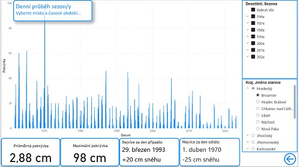
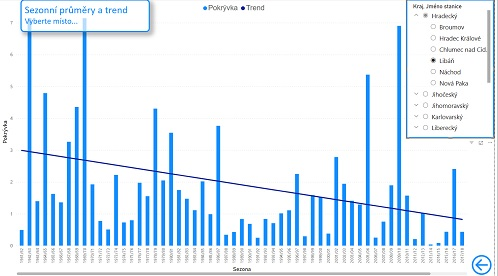

# Snow-Czech-Rep.
PowerBI report sněhové pokrývky v ČR za posledních 60 let.

5 projekt pro Engeto Data Academy

## Popis projektu
Tento projekt zobrazuje sněhovou pokrývku v ČR v průběhu posledních 60ti let včetně vyhodnocení trendů a dlouhodobých průměrů. Může být použit například pro vyhodnocení potenciálu investic do zimnních rekreačních zařízení nebo plánování vhodných termínů pro zimní dovolenou v dané lokalitě.

## Data
Data pochází z archivu [Českého Hydrometeorologického Ústavu](https://www.chmi.cz/historicka-data/pocasi/denni-data/Denni-data-dle-z.-123-1998-Sb#) Datová sada obsahuje více než 1,3 milionu denních hodnot sněhové pokrývky z 62 míst meteorologických stanic ČR.

## Spuštění projektu
Ke správné funkci dashboardu je nezbytné mít nainstalovaný MS PowerBI Desktop. Free verze ke stažení ze stránek [Microsoft Store](https://apps.microsoft.com/detail/9ntxr16hnw1t?hl=cs-cz&gl=CZ)
Poté už stačí jen dvojklikem spustit stažený soubor 'Snow_CZ.pbix'

